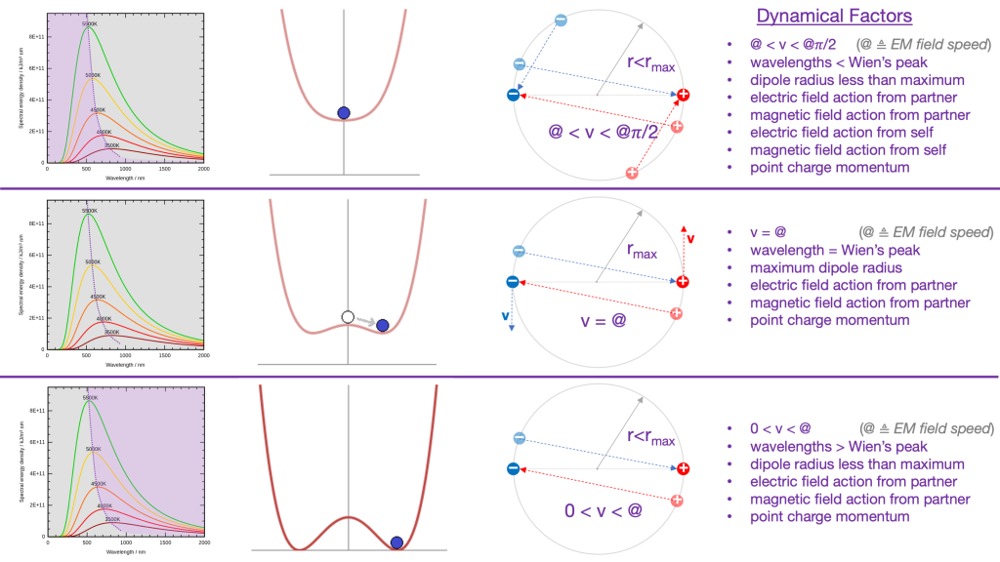

I made a new geometry diagram to help folks understand what I am imagining. The angular momentum vectors of the Noether core relate to the frequency and radius of the tri-binary components and hence to time and space. These angular momentum vectors are orders of magnitude different in scale, but still, I suspect they reach some kind of harmonic synchronization. I also think there is a mapping from these angular momentum vectors to the time + 3D space tensors in general relativity.

A really cool aspect of this model is that it has promises of answering so many question, like why do we have Fermi-Dirac and Bose-Einstein statistics and what is the implementation. In the point charge model these are two ends of a spectrum of angular momentum vector alignment. One end at low velocity is more 3D-ish and Fermi-Dirac with the Pauli exclusion and the other end at high velocity is 2D-ish and flat and no Pauli exclusion and we get Bose-Einstein statistics.

* * *

What follows is some social media dialog preserved for posterity. I think it is somewhat redundant with my previous writings. We start where I am making an esoteric point that the Lienard-Wiechert potential definitions are incorrect because they smuggle the speed of light into the definition, and light, aka photons, are a structure assembled from point charges. That kind of loop is not allowed in a proof.

Note how my statement caused offense. It is fascinating how ego and ego comparisons to selves and history play a role in the resistance to a paradigm shift. It has never made sense to me to soft-pedal the findings of the new era, but then again, I suck at E.Q.

I do have a goal to tell the story of point charge nature and the universe from first principles. It feels like I am making tremendous progress, but it is also a heck of a lot of work to sort everything out. That was a huge tree of false priors and when I chopped it down there are limbs and branches and twigs everywhere and well there is a lot of work to find the healthy limbs and graft them on to the NPQG tree. It's also a lot of work to sort out the ontology of what is really going on at each level. Then there is the question of terminology — what can come over whole? what terms need repair and refurbishment? what new terms are needed? I digress, returning to my interlocutor :

> _Incorrect? Now that is speaking from high horse... They are correct to 99.99999% (yes they were tested to at least this precision) There is some wiggle room in 1 in 10 millionth difference which is barely noticeable. But your result must match Liénatd-Wiechert result to 99.99997% precision at least or it is plain and simply wrong because your math contradicts lots of experiments then, and as such doesn't describe real world, because experiment is king_.
> 
> _Many people have this weird misconception that when new theory is created all the old ones are scrapped… That is not how it works. When new theory is created it adds very small correction to existing theories usually. Of course in some cases corrections might be not so small, but this happens only in 2 cases:  
> A) Such experiment was never done before  
> B) experiment was done but disagrees with old theory, while new theory matches it better_
> 
> _Liénard Wiechert potential are perfectly defined in the case of relativistic particles. Those relativistic potentials are used in experiments with accelerators and synchrotrons for tuning the synchrotrons which produce x rays for a variety of practical applications (diffraction tomography ombroscopy …)_
> 
> _So you cannot say _Liénard Wiechert_ is wrong in fact your point charge theory must be able to derive same thing as Liénard Wiechert did but add a tiny correction to it, and yes corrections must be tiny because we know that they are correct to 1 part in 4 million or so…_
> 
> _It is the Jefimenko's equations that allows to calculate the electric field magnetic field and potential vector related to the Liénard  Wiechert potentials_
> 
> _Just to be clear… You are allowed to derive their result in completely different way as long as actual numbers differ by no more than 0.00003% which is 5 sigma precision._
> 
> Interlocutors

My interlocutors went on to be confused about my esoteric point about photons being structure made of point charges. They objected to photons, which are neutral electrically, becing composed of point charges. They pondered why lasers are not affected by electromagnets if photons are made of point charges? I respond later, and these are easy questions.

Just rising now to see all this conversation. We are very close. I know it is difficult for you, but I think it would be better if you try to "steel-man" what I am saying, meaning find the best possible way to reach your hand across this ontological confusion and connect to what I am saying. Let me explain. Here is the ontological error : Physicists are so locked into the quantum that they do not realize the quantum is a behaviour of structure, specifically of the most dominant structure in the universe which is simply the two equal and opposite point charges chasing each other around in a circular orbit. That orbit changes depending on how much energy the binary possesses as measured in h-bar. This changes the frequency of the binary and its radius of orbit. Ok now you have h-bar for QM and changing frequency and radius are a variable clock and stretchy ruler of GR. Unification.

I think I have mentioned before, but the precision that QM based theories are able to reach is a clue, and not a challenge to be overcome. The reason the observations are so precise is that these structures are all based on these orbiting point charge binaries. 1 in 10 million is really very poor precision when your orbiting binary can theoretically go up to a frequency of 1044, the Planck frequency, and the theories mostly do this until of course structures become unstable with energy and decay. Again, please deploy the "steel-man" case and imagine I am not being arrogant from a high horse, but that I am operating from a place where I can see the ontological problems with the existing theories of GR, QM, and LCDM. It is really simple, but QM folks are so locked into the quantum that they cannot suspend disbelief and flip their understanding to the possibility that the ground floor is point charges operating in a continuous Euclidean geometry and that the quantum world is largely describing the structures into which these point charges assemble.

I'm not sure the Liénard Wiechert potential equations are correct, but I hope they are. I need to work on that. However, they are most certainly not "defined" correctly. You can not use a photon in a first principles mathematical proof of how point charges operate at an ontological level below where the photon structure itself is formed. The photon appears to be a set of twelve point charges arranged in two sets of six, which are themselves arranged in a contra-rotating coaxial structure. I show this here.

The wikipedia definition for Liénard Wiechert potentials states that "Electromagnetic radiation in the form of waves can be obtained from these potentials." That is huge because physicists think the photon's electromagnetic field is self-propagating and they don't yet imagine that they are created by point charges, which are self propagating. It's enlightening that Liénard Wiechert potentials proved that the electromagnetic field of a photon are consistent with emanations from point charges. Here is a picture :

What I am proposing even explains why you have gauge theories. Anytime you are working with the Lorenz gauge, I suggest that you are working on a part of nature that involves point charge binaries and their behaviour which is Lorentz invariant. In the Coulomb gauge, the vector potential is quantized but the Coulomb interaction is not. That makes total sense when the vector potential is caused by a point charge binary structures and we are working on problems directly related to the continuous realm of individual point charge behaviour.

I get that you are skeptical, but we are so close to a breakthrough in understanding. The key to understanding is to reframe GR and QM as theories that are describing the behaviour of structures that emerge from a continuous world of point charges operating in a potential field. You get to keep that one field. All other "fields" are local patterns in the potential field that are generated by the point charge structures. You get to keep those fields too, but they must be reinterpreted now at a higher level of emergence and assembly.

It's up to you if you want to throw in the towel on my theory. I don't intend to force anyone to think about these ideas. However, I do feel obligated to share that once you get over this enormous mental block in thinking that has stymied the scientists, that everything is so much easier on the flip side below GR and QM where everything is unified by point charges operating continuously in a changing electric field which is the time delayed superposition of electric field emitted by all point charges (including themselves if they move faster than field speed and encounter their own electric field - this seems to be essential).

Why is it so much easier to think in terms of point charges? Because it is simple. They find themselves bathed in the electric field of all point charges and the gradients of that electric field determine E and B and hence the action upon the point charge. So each point charge is simply flying around and being acted upon by the gradients of the electric field. The fact that repeating structures form that have a frequency should be no surprise. Those structures assemble together as I have shown in my primitive artwork and those are stable structures and you can topologically rotate them and do all the things QM based theories say.

> _You are under the false assumption that point charges and just EM force is enough to explain strong and weak force._
> 
> Interlocutor

It's not a false assumption. It's just emergent behaviour. One of the main structures that forms is three nested binaries with each of these binaries at vastly different energy levels and orbital radii and frequency. That seems to be the dominant higher order structure in the universe and it is re-used in all standard matter particles and in spacetime aether particles as well. It looks like the strong force is a result of these tri-binary structures and how they behave when they are part of a larger structure. The weak force appears to be related to the interaction of far lower energy point charges that can fly around a tri-binary core. Again, I suggest that it would be far more productive to have fun with my ideas and imagine how they could be improved.

I don't think your criticism is fair. I've now written 310 blog posts and created dozens of charts showing what is going on geometrically. The hard part is finding out where GR, QM, and LCDM made ontological errors and then figuring out how to correct them. I can see that even Jefimenko's equations smuggle the speed of light into their definition. That is not correct. It may lead to the same equations, but it is still not a first principles definition. So when you say I am not showing formulas, I think that is a but unfair. First I am peeling back all the errors and then I have to start over from scratch and define an entirely new dynamical geometry of point charge paths. Hopefully Jefimenko's equations and the Liénard Wiechert potential equations will be solid stepping stones once I recast them so they are not based upon photon structures.

I have given up on trying to "convince" others because it leads to this weird naysaying skeptical dynamic in communication which I find to be incredibly frustrating and depressing. I've scaled back my approach to simply offering updates on my investigations. I do have some hope that the light bulb will turn on for others and they will "get it". My efforts are painstaking, but I'm personally pleased with my progress. I'm going to give another shot at the math of the basic pair of orbiting point charges with electrodynamics and see if I can extract the math that ties h-bar, orbital radius, and frequency together -- because that first emergent structure, the binary, is where I believe GR and QM intersect. As always, the ideas are open source, so if any of you feel like suspending disbelief and studying my geometrical drawings, I'm fairly certain you could make much faster progress than I. If so, fantastic!

H-bar is the quantum of energy or a proxy for it. H-bar is a measure of an increment in angular momentum. I think that each time we add or subtract an h-bar of angular momentum from a point charge binary, the frequency and the orbital radius of the binary change. That makes the binary a variable clock and a stretchy ruler which is exactly what we need for GR. Here is a diagram.

The double slit is a fairly big system of interacting structures, but suffice to say it is the pilot wave theory that explains it and it is well known that the math of pilot wave systems solves double slit as well as Bell's inequalities. Bottom line is that a stable clump of point charges executing a set of wave equations (one per point change) will interact with the spacetime aether which is made from zillions of low apparent energy point charge structures, again with each point charge executing it's own repeated wave equation in that structure type. Meanwhile all of these point charges are emitting their electric potential spherically at every point along their continuous path of travel.

Now this is where I will hand wave and say the summation (superposition) of those electric potential waves and the ringing and bounce back from their action causing path changes for all of these involved point charges is what leads to path changing interference patterns for the particle approaching the slits. Whether both slits are open or one is closed makes a difference in the patterns of the potential field. I have no idea how to describe this in mathematical terms. I think it is better for me to work on the math of the single point charge binary. I would say that if one conceives of spacetime as a pure geometry with no implementation then it is going to be very difficult to explain pilot waves. Instead, if you consider spacetime as an aether of low apparent energy point charge structures then it is a different story because now we have a medium for interaction between the particle we are shooting at the slits and the spacetime through which that particle is traveling.

We do detect the medium of spacetime via gravity which is incredibly weak, and we also have dark matter and dark energy. We just don't know how to explain it yet. String theory, loop quantum gravity, t 'Hooft's cogwheels, and so many other low level theories are lost in their ontologies often because they are resting upon cognitive errors due to false prior interpretations. Again, observations are fine, and the math is effective, but the false prior interpretations are the root cause of the crisis in physics and cosmology. I've demonstrated in this thread how even Liénard Wiechert potentials are tossed aside for not being quantum. I assert that it is actually the other way around, that the quantum is an emergent behaviour from an ontological assembly level above point charges operating in a continuum of time and space.

Re-reading some of the earlier dialogue - to the extent anything in the current era theories involves a charge changing, then that is a flaw in the theory in my estimation. The way I look at it we have these asymptotically safe point charges at |e/6| and you can have a fair number of them per standard matter particle I think a photon is 12 point charges (6:6), electron also assembled from 12 (9 electrino : 3 positrino), and 36 point charges per nucleon, i.e., proton or neutron. You can look at the chart I posted earlier and count them. Also, the scales at which these things are flying around are well below what we can observe today so we are talking really super high energy with radii very small. So I can definitely understand why an electromagnet of the scale we can build may not have an observable impact on a photon. That electromagnet is noise to the point charges in the photon. You know the frequencies from the E-M spectrum. Those frequencies are what corresponds the observable binaries. And, remember, you can derive the electromagnetic wave from the Liénard Wiechert potentials, which are themselves derived from point charges.

<figure>

<figcaption>

Britannica

</figcaption>

</figure>

> _Flaw in theory… that is like the biggest discovery in Large Hadron Collider and you just discount as “nah you are wrong you didn’t discover anything”  
> You think people in CERN are delusional or something? Because charge changing happening at extremely high energies (Big Bang level energies) is pretty much confirmed fact… not that it doesn’t fit with your theory because it can be explained as structure of point changes just rearranging themselves at high energy I suppose… but at lower energies they get frozen in place, but still it definitely happens… I talk about isospin and weak charge… just watch the latest video by PBS Spacetime to understand what I am talking about_.
> 
> Interlocutor

It is fascinating how ego and ego comparisons to selves and history play a role in the resistance to a paradigm shift. It has never made sense to me to soft-pedal the findings of the new era, but then again, I suck at E.Q. It is not scientific to get emotional in response to my statements. Of course you would expect someone who had a better vantage point to point out flaws. And besides, isn't it quite easy to vary some other variable instead of charge? Maybe distance? Look, I'm not trying to irritate anyone on purpose, I'm just saying point charges are immutable.

The problems with the false priors where point charges were set aside happened in the 1800s and the false prior tree has grown and spread since then. 1927 Solvay QM was a huge growth ring for false priors. So the people at CERN today are working in a field that is based on false priors. I don't think they are personally delusional, but they have inherited a delusion that clouds their outlook on nature. What is the opposite of "standing on the shoulders of giants?" p.s., I am speaking of false priors in narrative that have confused the ontology. Experiments are fine and patchwork math are effective.

> _Nah I am saying that charge of particles changing is a fact… interestingly enough rather than going against your theory it actually speaks in favor of you theory. As it can be explained that in very high energy plasma those 1/6 E charges are more free to rearrange into different particles_

Ok, well, if we are talking about structures of point charges, then sure, at high energy there are a lot of reactions they can experience that might add or remove point charges to the structure, thus changing the net charge of the structure. This is a good point.

The giants in physics were bonafide intellectual giants, it's just that they were giants in **effective theory** space. What we need is the paradigm shift that reconciles all the confusion. I am suggesting that if we simply rebase one level lower than the standard model, on point charges, we can reconcile all the theories and issues. And it makes total sense that raw point charges in Euclidean space and time would form structure. We are blinded by structure. All our observables are of structures we call photons. Think about what that means. Every CCD is registering a response from the accumulated impact of photons, which are contra-rotating coaxial point charge binaries. Each photon has six positive point charges and six negative point charges. It's really that straightforward, like models of cars on the highway.

**_J Mark Morris : Boston : Massachusetts_**

p.s. It doesn't make me uneasy to think of humanity as composed of quarks, electrons, and photons with neutrinos flying through and some nebulous definition of spacetime, dark matter, and dark energy. I have no problem with that. However, when it gets down to just positive and negative point charge, as I think is a solution, it does give me some pause, concern, and clarity. I wonder if anyone else has considered this from a philosophical point of view.
