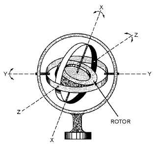
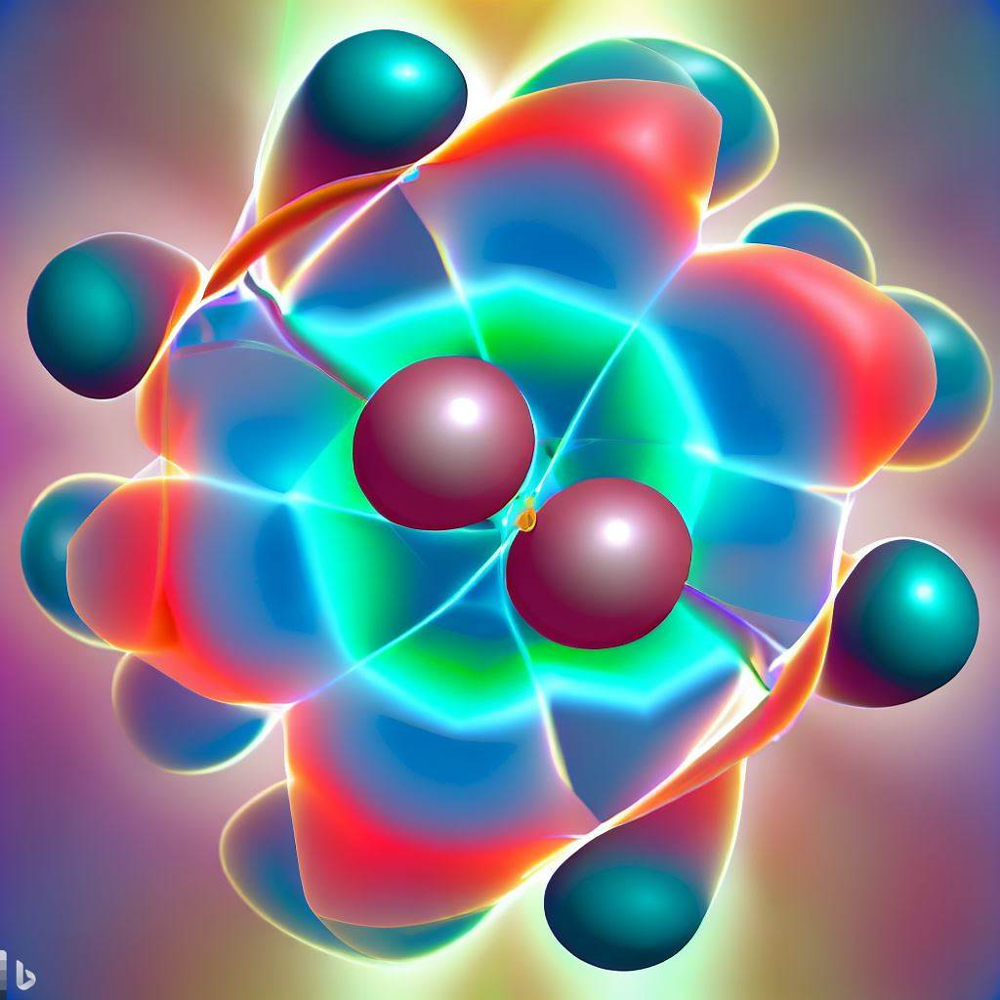
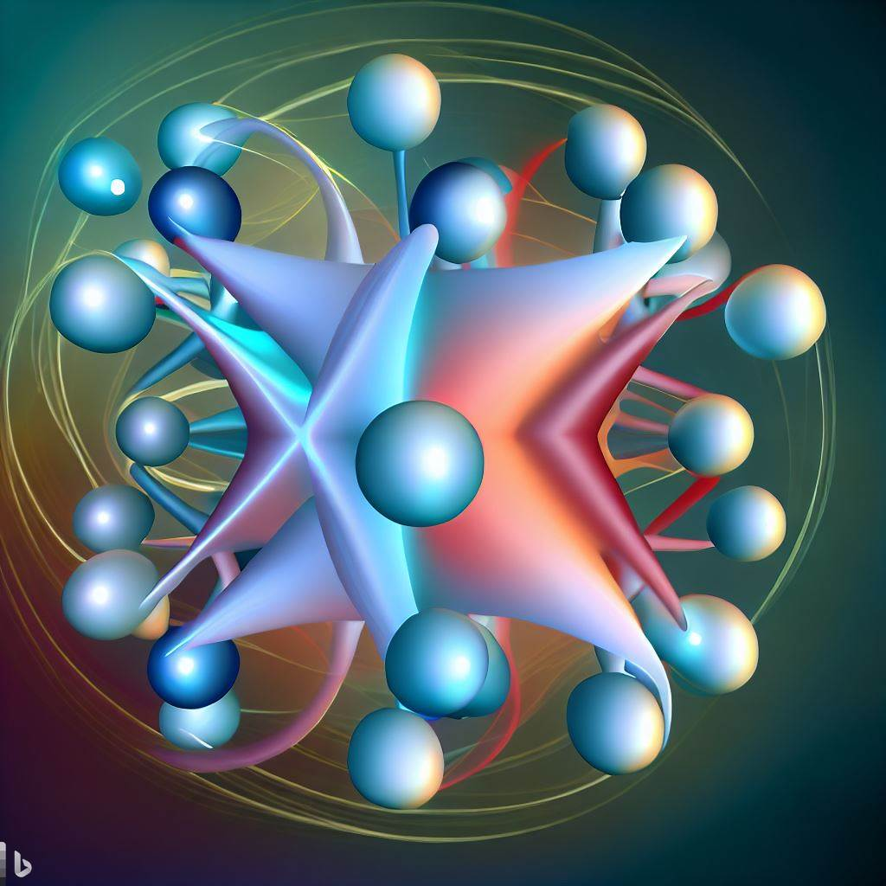

> **The Universe is indistinguishable from infinite Euclidean time and space permeated by assemblies that emerge from energetic point charges and a lineage of reactions.**
> 
> J Mark Morris

There is a sub-assembly lineage which leads to the gyroscopic energy core which is composed of three orbiting and coupled binaries. It's easiest to think of it as three planar electrino:positrino orbits and that makes a lot of sense, but these binary orbits are more than likely precessing and changing due to other dynamical factors at the same time. Imagine trying to sleuth out that adaptable wave equation without knowledge of the structure!

https://videopress.com/v/1F868dZB?resizeToParent=true&cover=true&autoPlay=true&posterUrl=https%3A%2F%2Fvideos.files.wordpress.com%2F1F868dZB%2Fnoether-core\_mov\_std.original.jpg&preloadContent=metadata&useAverageColor=true

The three nested and orbiting electrino : positrino binary at different energy levels form a gyroscope of sorts. You could even legitimately say a quantum gyroscope! My vote is that it should be named after Emmy Noether because I think it implements conservation in several ways. The sheer wonder is that unlike the **mysterious quantum**, we can study assemblies and understand how nature physically implements the universe.

<figure>

<figcaption>

http://electriciantraining.tpub.com/14187/css/Basic-Properties-Of-Gyroscopes-130.htm

</figcaption>

</figure>

The energy core may be '_decorated_' with personality layer of point charges. All standard matter particles are based on variations and emergence from this architecture. Science will determine the proper terminology. I sometimes think about it like a series of future Tesla vehicle models, each being a different external technology configuration on a common gyroscopic flywheel energy core technology.

Here is my diagram depicting the decoding of nature so far. Since finding this pattern, my mind has been racing fast with ideas. It's as if the allegory of the cave person found a new passage with never seen before technology and is trying to make sense of it. Still, it is bittersweet, because I think it was really unfortunate that professional scientists did not discover this 90 to 135 years ago. They were right on top of the solution several times.

We must consider that this is a powerful degree of knowledge already and professional scientists will make many rapid advances once they adopt this model. With that accelerated pace in knowledge and technology come both risks and rewards.

It's speculative to say when in history is the right or wrong moment for such a discovery. In retrospect, it is possible that discovery in the era 90 to 135 years ago could have led to calamity. There is no guarantee it won't lead to calamity at this point. I don't know how to time a discovery of this magnitude relative to people who would use new technology for evil purposes. Is any time better than another? Is this the missing factor in the Drake equation?

The architecture of nature is so simple that it is only a matter of years or a few decades until it is found by professional scientists. It is very possible that artificial intelligence may find the solution before scientists. Meanwhile, intelligent life already has many technological opportunities to snuff itself out and we have been dealing with nuclear weapons, biological weapons, terrorism, and advances like CRISPR. That's not to mention all the businesses which profited while polluting with abandon and without remediation.

It is certainly possible and also deeply concerning that knowledge of the point charge architecture of nature could enable a new regime of weapons that are better, cheaper, and/or faster at destruction of intelligent life and their economies. Lastly, even if we don't manage to snuff ourselves out here on earth there are many ways for intelligent life to prolong risk and remain locally bound to a planet or solar system. Sorry to be so dark, but I think it is the cynical reality of this era.

We must also consider the upside of fundamental knowledge of immutable point charges. Neoclassical Physics and Quantum Gravity opens up all forms of science and technology to highly accelerated progress. Rapid technological progress is generally considered a good thing for people and the economy. It is also time to set national and international goals for seeding the solar system and galaxy with intelligent life. There is an immense amount of work to be done in every possible area. I hope that many fields in academia will integrate such a global initiative into their research. I'm thinking pretty much every academic field will need to address this new frontier at scale.

Update April 2023

> _In a hypothetical idealized geometrical model create an image of how nine negative |e/6| magnitude point charges and three positive |e/6| magnitude point charges at vastly different kinetic and potential energies, could form a stable dynamical geometry assembly. Show the negative point charge as a shiny bright blue spheres and the positive point charge as a shiny bright red spheres._
> 
> Prompt to Bing Ai

I am very impressed with the images Bai created. Bai also said that the abstracted shapes are depicting electric field lines. I kid you not.

Those were 2 of 4 images generated on my first prompt. I presume a far more descriptive prompt would result in a better image. I imagine that with training on the entire STEM corpus, and dialing down the righteous GR/QM rhetoric, that Ai will be able to solve nature with me soon.

