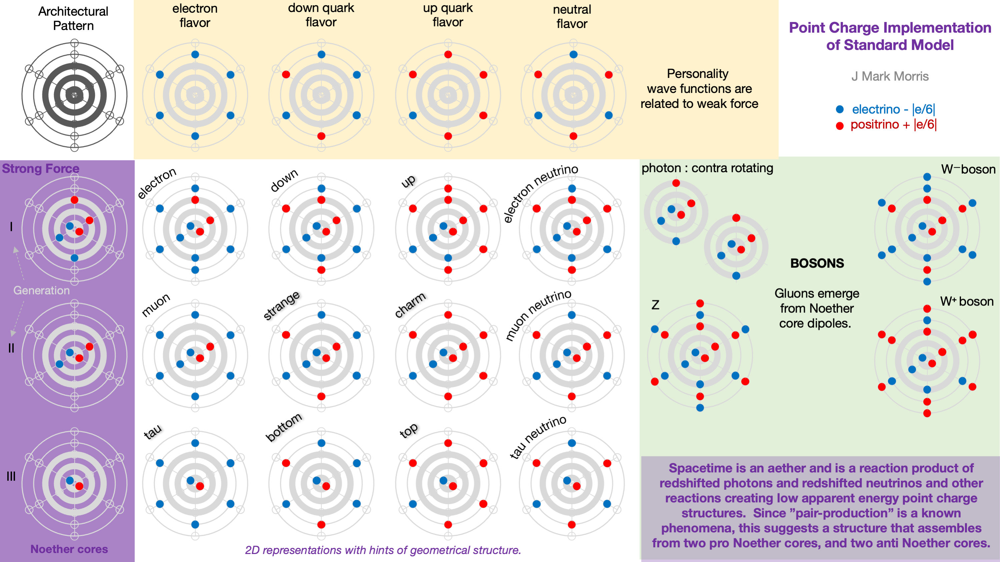
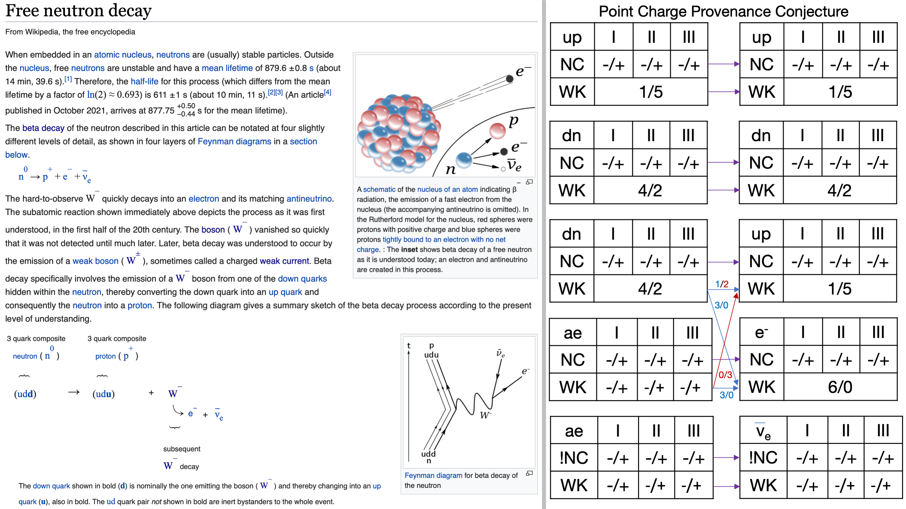
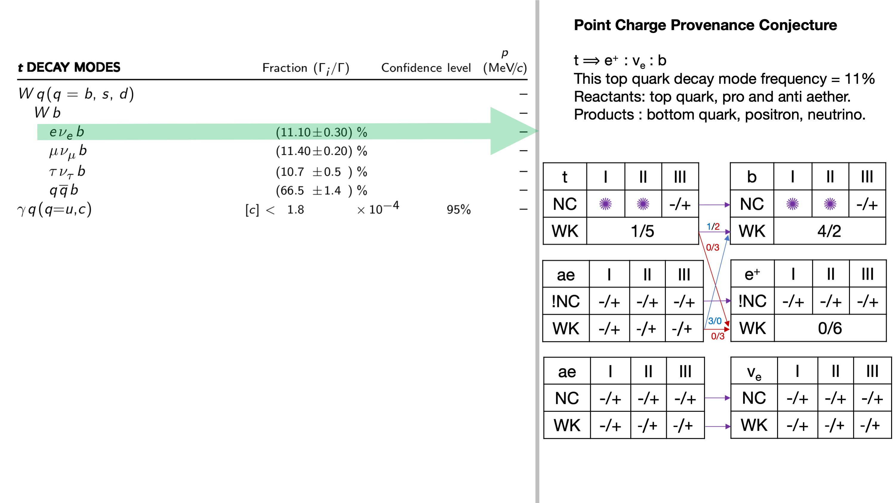
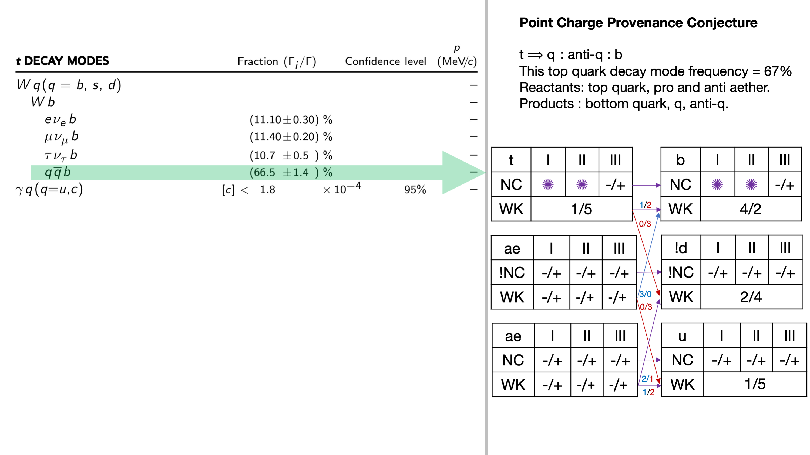
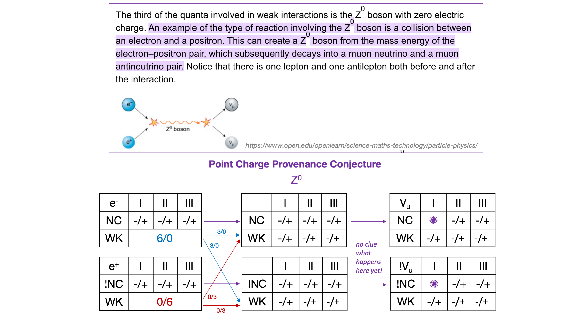
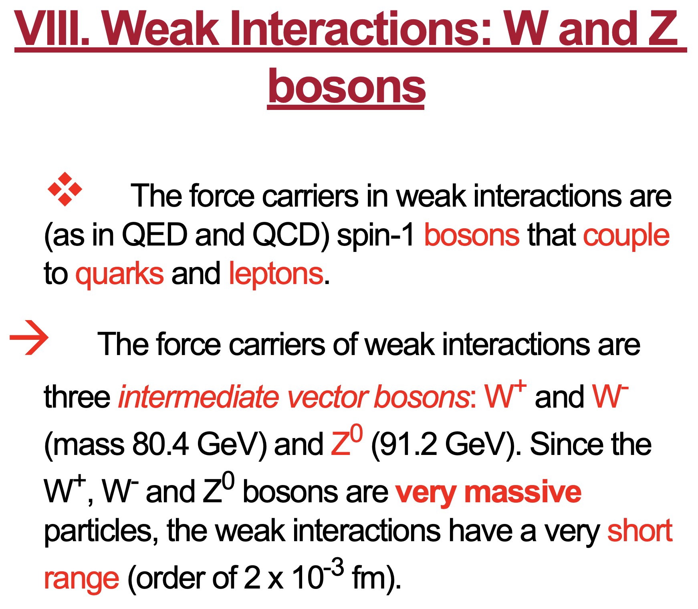

I have been refining the point charge assembly model for standard model particle assemblies for several years now. In 2018 it was so abstracted from nature as to be not even wrong. In the intervening years, the NPQG thought experiment and vision has made tremendous progress in deciphering nature as a parsimonious emergent set of assemblies derived from energetic point charges in a Euclidean void of time and space. Throughout this period, one unvarying principle has been the idea of two fundamental unit potential point charges, aka the electrino and the positrino, with charge magnitudes -|e/6| and +|e/6| respectively, and with the property of immutability.

When last I examined the photon, W and Z bosons I was hot on the trail of decoding the photon as a contra-rotating coaxial pair of pro and anti Noether cores, with all orbits transverse to the line of assembly travel. I don't recall how I arrived at the architecture of the W and Z boson as having 18 point charges in their assembly. With the evolved understanding of the neutrino, photon, and the aether assemblies, and how Noether cores shape-shift from Fermi-Dirac 3D assemblies to Bose-Einstein 2D-ish assemblies it is time to revisit the W and Z.

<figure>

<figcaption>

The prior version. The more parsimonious update is below.

</figcaption>

</figure>

As we re-examine the W and Z bosons, let's see if we can make some educated conjecture on the provenance of the Noether cores and the personality point charges in the reactions. Perhaps we can figure out some kind of Feynman like diagrams with the next level of detail.

Even better, we will be able to simulate these reactions with Monte-Carlo simulations, Ai assisted modeling, and other optimization techniques. Simulation professionals are very advanced I don't have a clue about their state of the art terminology. I just "know" that it can be done and it's probably not all that complex mathematically. However, it may be quite a lot of computation to scale to very large systems in time or space.

There is incredible amount of valuable precise science that can be done with the point charge model. I would expect simulations would scale to millions, if not billions, of point charges with existing technology, which would enable significant progress in many sciences for a decade or more.

There are also many scientific and technological challenges where the behaviour to be modeled requires a large temporal and/or spatial scale and where the number of point charges to be simulated or modeled is enormous. The most precise simulations must keep track of the path of each point charge and calculate the next absolute time increment. These simulation tools could evolve to be sophisticated computational systems with architectures blending supercomputing, Ai models, floating potential generators, and the modeling of the point charge path as it crosses the symmetry breaking velocity equal to field speed.

In the meantime, we can make educated guesses based upon our current point charge knowledge foundation and the simple fact that if it is corret, it must match or map to observations past and future. Maps between point charge theory and general relativity and quantum theories are extremely valuable as wel and those maps come in many forms from the logical to geometrical to mathematical. Even the explanation of how incorrect narratives arose is valuable.

Let's start by examining neutron decay. The left panel shows the Wikipedia explanation of free neutron decay in terms of what is currently thought to be unique and fundamental standard matter particles. The right panel shows the reaction with one possibility for the point charge provenance of the reaction. The inputs are the neutron composed of up, down, and down quarks PLUS a spacetime aether contribution of pro and anti particles that are like ultimately redshifted neutrinos.

How might we imagine this reaction occurring? Perhaps one of the down quarks reaches an semi-stable or unstable portion of its wave equation and somehow weakly couples with a 6/6 pro aether assembly. Let's imagine that the up quark provides 3 electrinos to the aether assembly and the aether assembly responds by exchanging 3 positrinos. Bingo, bango, bongo all the Noether cores transition directly left to right, and the weak exchange transforms the neutron to a proton.

As for the point charges in the W\- boson it is difficult to say exactly what or when in the reaction process is defined as the W\- boson. All the point charges are accounted for in the input down quark and the pro and anti aether assemblies. Note that if there is a weak coupling of some polar vortices that it makes sense that it would be the attractive force of the opposite weak charges that would initiate the coupling. Note that there are several potential vortex combinations as well. What is the initiating event for the exchange? Opposite spin vortices? Matching spin vortices? That's kind of hard to guess right now. It's all about the potential field patterns that are impinging on each point charge in the assembly and determining its future continuous path in absolute time and space.

So where is the W\- boson in the point charge provenance diagram? Clearly the apparent energy of the anti-aether assembly increases as it transforms into an anti-neutrino and zips off through the spacetime aether. State if of the art (2022) scientific theory and observations attribute that increased apparent energy to the W\- boson. The neutrino has low apparent energy although it is orders of magnitude more apparent energy than spacetime aether assemblies. Still the neutrino has only a tiny fraction of the energy of the W\- boson. We also don't have any idea of the accounting of energy that transitioned between shielded form and apparent form and back again to shielded form. Simulation technologies can enable tracking the provenance of this energy.

I've included charts of the history of scientific observations of the W\- boson mass. The CDF II observations (2022) are said to be suggestive of new physics beyond the standard model. Yes, that is true, but if the reaction conjecture is correct, then the W\- boson is actually a dynamic intermediate state of point charge assemblies with varying apparent and shielded energy. Note that the W and Z bosons have a very short lifetime with a half life of 3×10−25 seconds.

Is there a natural explanation for the diversity of the recent and historical measurements? With the insights from the point charge conjecture the W\- boson and looking at the history of observations I suspect the experimental design influences the observational window into the reaction. And it seems logical that the W and Z bosons are each an ephemeral state of a reaction where point charges and energy are being exchanged. Perhaps someday simulation will allow us to explore this conjecture and understand the exact dynamics.

* * *

W and Z bosons are considered to travel at the speed of light and we will need to see how that relates to the potential field speed @. Is the reaction precipitated by point charge velocities reaching the symmetry breaking point of v = @? Momentum must be conserved of course.

Perhaps the symmetry breaking point of v=@ is where photons and neutrinos are launched in the vortex? But that would only be the case if an aether assembly had coupled in a certain way? And likewise it could go the other way and deposit energy into the core.

Let’s brainstorm a point charge conjecture on some top quark decay modes from the Particle Data Group (PDG). The PDG notation is compact and I'm not entirely confident of my interpretation. Still, it's worth brainstorming the dynamics

We must first recognize that any group of reacting particles necessarily has a tremendous amount of variability related to each assembly. This includes the local spacetime aether assemblies as well. The reaction product outcome probabilities are presumably influenced by these variations in experiment.

- The path of each point charge in the assembly throughout the reaction can be related to the dynamical geometry of the assembly.
    - Phase of each wave orbital path.
    
    - Precession of Noether core binaries.
    
    - Vortex back-reaction? The action on a weak charge from 2+ vortices, in turn and time causes action upon the vortex binary, which in turn causes action upon the weak charge, and etc.
    
    - We can't be surprised at the complexity because this is a dynamical geometry where the Dirac sphere stream of each point charge is constantly interacting with each other point charge and sometimes themselves.
    
    - Modeling nature at the fundamental level will reveal to us the precise behaviours and probabilities of assemblies and interactions.
    
    - It is possible that there are a variety of chaotic reactive outcomes where assembly fragments are a product of the reaction.
    
    - Modeling at the assembly and reaction level is also valuable, because it leads to myriad technologies that will be enabled by ready access to the source code to nature and object oriented assemblies.

- The top quark (t) is so short lived that we presume it was a product of a collider reaction that decayed the generation I and II binaries.
    - This leaves the unshielded generation III highest energy binary which is highly reactive.
    
    - The remaining binary presumably interacts with local spacetime aether assemblies of pro and anti Noether cores.
    
    - The ensuing reaction has an intermediate state range we call the W boson.

- Note that some reaction products are actually themselves unstable, such as the bottom and strange quark outcomes. Even the down quark outcome is only stable if it is incorporated into a nucleon.

Here is the provenance conjecture for one top quark decay mode. It is strikingly similar to the down quark to up quark decay we analyzed in free neutron decay above. The charge movement is different, yet symmetric. Interestingly in both cases the decaying quark transfers a 1/2 weak point charge trio to the product quark. Why is that? Were they in the coupled vortices or the uncoupled vortices?

Now observe that the next two product outcomes replace the electron with the muon and then with the tau. Examining the diagram above it may be possible that the exchanged positrino triplet may form around a partial Noether core. Perhaps those alternate Noether cores are the ones dislodged in the collider event, i.e., the Gen I and II binaries of the top quark Noether core. It seems plausible, but only simulation will tell us for sure.

Next, let's examine the q : anti-q : b outcome with frequency 66.5%.

- The up (1/5) and anti-down (2/4) have net charge (3/9) = (0/6)

- These products match the net charge of the W+ boson.

If on the other hand we were charting the provenance of the bottom quark decay to the charm quark, then the q : anti-q case would produce the down and anti-up quarks.

- The down (4/2) and anti-up (5/1) have net charge (9/3) = (6/0)

- These products match the net charge of the W\- boson.

Ok, so that was fun to brainstorm about the PDG decays. Is the conjecture correct? I would guess there are parts that are at least directionally correct. My objective was to explore the patterns that emerge and see if there are plausible mechanisms and the proper degrees of freedom. My intuition says that going through this exercise is an early step forward in understanding the science of assembly reactions involving the W and Z bosons.

* * *

Let's take a look at a Z0 boson reaction for good measure. We might imagine that the first part of the pictured collision causes an exchange of weak charge that results in the Z0 boson which would look a lot like an aether assembly couplet. Now, it's not clear in this case if aether assemblies have a major role to play. As with the W reactions it appears that shielded energy is revealed in the reaction and is attributed to the boson mass. Regarding the final stage of release of pro and anti neutrino, which have low mass, this begs the question of where did the Z0 boson mass get tucked away as shielded energy? This then raise the question of whether spacetime aether is involved in the overall collision/reaction. Still, this is a good start and simulation will ultimately show us what really happens.

NPQG considers the spacetime aether, a condensate of low apparent energy pro and anti Noether cores possibly with net neutral weak charges in the assemblies. It makes sense that this implementation would map directly to the SM condensate of the Higgs field. The assemblies comprising the aether therefore map to the Higgs boson.

One huge open question is how much shielded energy is harboring in spacetime aether assemblies? Possibly quite a lot given how much energy we must use to crack open standard model assemblies in a collider and what we measure as the mass of the Higgs and the W and Z bosons. Another question is exactly how does the spacetime aether achieve such amazing energy shielding? What are the implications for the creation of spacetime aether? There's a lot to contemplate.

It seems that the logical conclusion is that spacetime aether assemblies have quite a lot of shielded energy but they are shielded so well that they are unreactive at low energies except to participate in the floating potential background and interaction with mass (apparent energy). Many assembly reactions appear to have spacetime aether assemblies and detritus as previously unaccounted for reactants and products.

So the spacetime aether assemblies, pro and anti Noether cores, are essential ingredients in the weak reactions, and they reveal the shielded energy in spacetime aether in different forms depending on the reaction. The Higgs is capable of transforming into the photon, the neutrino : anti-neutrino pair, a quark : anti-quark pair, and an electron : positron pair. So the Higgs aether should be at the foundation of the boson chart, showing the transform to the other bosons.

These conjectures and brainstorms and insights lead to a refreshed and more parsimonious vision for the point charge periodic table of the standard model. First, the outer ring of point charges is eliminated, as it appears the W and Z boson geometry is different than previously imagined. Instead the W and Z bosons are intermediate reaction states that involve the Higgs spacetime aether assemblies. This version of the chart has less ink and is hopefully more intuitive.

Below is a section of a CERN lecture. Note the discussion that the bosons are spin-1 and couple to quarks and leptons, i.e. fermions. Of course this makes complete sense with the point charge architecture and vortex coupling and the notion of exchange of weak charges via a vortex. Also, the point charge architecture demonstrates that Fermi-Dirac spin 1/2 particles are Noether core based where the axis are not aligned and precess such that rotation through 720 degrees brings the orbit back to the original state. Spin 1 bosons have all orbits aligned coaxially on the direction of travel. Thus spin-1 bosons are more planar (or multi-planar) and follow Bose-Einstein statistics.

<figure>

<figcaption>

http://hedberg.web.cern.ch/hedberg/lectures/ch8\_2005\_lec3.pdf

</figcaption>

</figure>

**_J Mark Morris : San Diego : California_**
