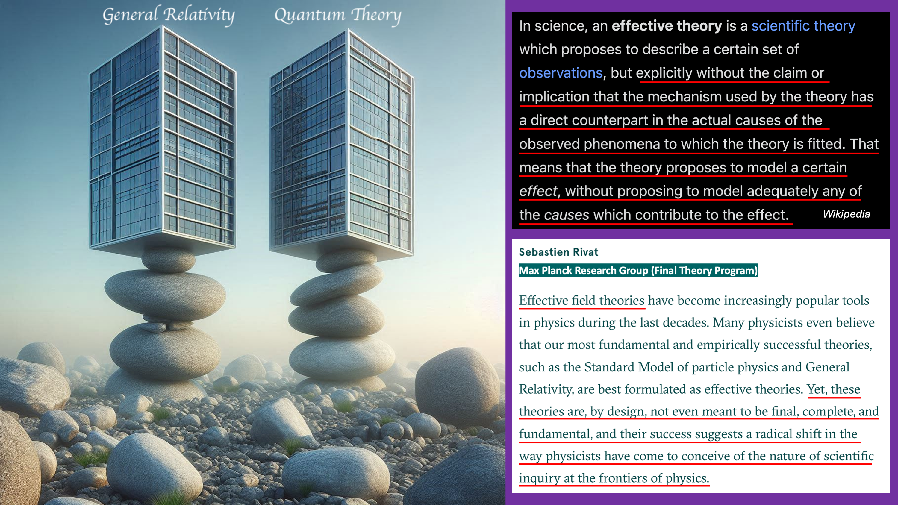

Let's talk about whether point potentials should be considered matter or material. First let's read a brief explainer from CoPilot Ai about the definitions of matter and material in both particle physics and philosophy. Then we'll consider the point potential universe.

> In the field of particle physics, matter is defined as a substance consisting of particles that exhibit rest mass. At the most fundamental level, matter is composed of elementary particles known as **quarks** and **leptons** (the class of elementary particles that includes electrons).
> 
> Quarks combine into protons and neutrons and, along with electrons, form atoms of the elements of the periodic table, such as hydrogen, oxygen, and iron. Atoms may combine further into molecules such as the water molecule, H2O. Large groups of atoms or molecules in turn form the bulk matter of everyday life.
> 
> It's important to note that in the Standard Model of particle physics, matter is not a fundamental concept because the elementary constituents of atoms are quantum entities which do not have an inherent "size" or "volume" in any everyday sense of the word. Due to the exclusion principle and other fundamental interactions, fermions (quarks, leptons), and many composites and atoms, are effectively forced to keep a distance from other particles under everyday conditions; this creates the property of matter which appears to us as matter taking up space.
> 
> It's also worth noting that matter should not be confused with mass, as the two are not the same in modern physics. Matter is a general term describing any 'physical substance', while mass is a quantitative property of matter and other substances or systems.
> 
> In particle physics, the term "material" is often used interchangeably with "matter".
> 
> In philosophy, particularly in the philosophy of materialism, "material" refers to the fundamental substance in nature. Materialism posits that all things, including mental states and consciousness, are results of material interactions. This view holds that everything that exists is physical, and all processes arise from material interactions.
> 
> Materialism directly contrasts with idealism, which posits that consciousness is the fundamental substance of nature. Philosophical materialism is closely related to physicalism—the view that all that exists is ultimately physical.
> 
> So, while particle physics studies the fundamental particles that constitute material, philosophical materialism explores the implications of everything in the universe being composed of this material. It's a fascinating intersection of science and philosophy!

Contrast the point potential model with the GR/QM model. General relativity offers no implementation of spacetime. It offers no explanation for why spacetime is curved other than the presence of mass, which science cannot explain either. Quantum theory offers the idea of a roiling quantum vacuum, which is an oxymoron, from which standard matter particles can be produced or to which standard matter particles can annihilate. Essentially GR and QM are a castle in the air, yet scientists continue to ignore the well known fact that there is no foundation. What is worse is that physicists keep trying to determine the foundation to GR and QM from within their faulty ontology. It's like trying to put in a foundation for a building without one but trying to build that foundation from the rooftop of the skyscraper. It's absolute nonsense and rubbish. And it is wasting a tremendous amount of public funding and what is worse, mental talent that could be making incredibly rapid progress if they had the proper ontology.

A Euclidean 3D space is totally empty. It is akin to the original classical concept of a vacuum which was truly empty space. Euclidean 3D space and 1D forward moving linear time are the background to the universe. You can think of it as absolute space and absolute time. If there were no contents to 1D time and 3D Euclidean space, then there would be no observables, no origin, no metrics, no reference points, no way to define a unit of length or a unit of elapsed time. There is also no known origin story, i.e., no known beginning in time or space. There is no known end in time or space. It then becomes philosophical whether you want to consider absolute time and absolute space as "material". They exist in some sense.

The requirements on time and space are the following. They must be capable of being populated with point potentials. Those point potentials constantly emit potential which expands spherically at field speed. Those point potentials must be allowed to move in response to action. Action occurs when a potential sphere intersects a point potential.

The most conventionally "material" item in the point potential universe, is the point potentials themselves. However, they have zero radius and are modeled as a Dirac delta that can move and constantly emit potential. In the end, the concept of what are the "material" entities in the point potential model will surely be a philosophical discussion point for quite some time.

There are some interesting implications of the point potential model. One is that simulation is straightforward. You can model absolute time and absolute space in software simply as a real number domain, i.e., R4, with some constraints on time moving forward only. Also, you can store only path history of point potentials and the potential spheres can be entirely calculated. So in that sense, do sphere streams really exist? This also seems philosophical to me.

In reality, point potentials populate absolute time and space, so there are no points in the universe that are truly empty of everything — every point potential has released a space filling sphere stream in its path history. So, if we model conventionally the way humans tend to visualize, there is "something" present in every point in time and space. I think that will appeal to some because they are used to the classical models of time and space.

It's interesting in the point potential universe that the potential does not matter to the mathematics or simulation at any point in space that does not have a point potential at the moment. Meaning also there is no point in time and space that is truly void. We can model the universe abstractly, only with reference to paths in R4. From a model point of view it doesn't really matter if the background **exists**, since everything is computable from an abstract 3D Euclidean space and 1D time where the contents can be referenced with respect to that coordinate system. It is very clear that the universe is a dynamical geometry of point potentials. That's really it. There's no shenanigans or special cases. It's a lot easier to understand at this base level than general relativity and quantum theories.

**_J Mark Morris : Lynn : Massachusetts_**
