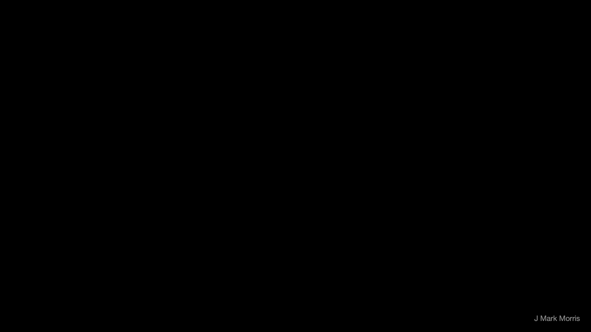
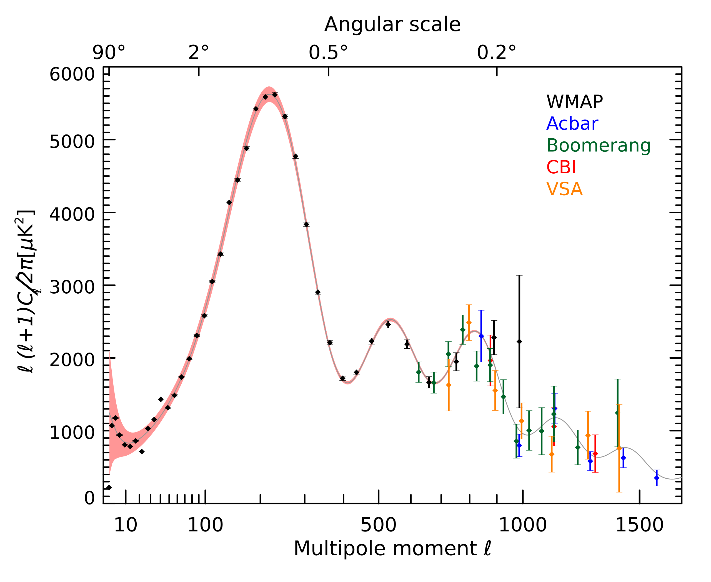
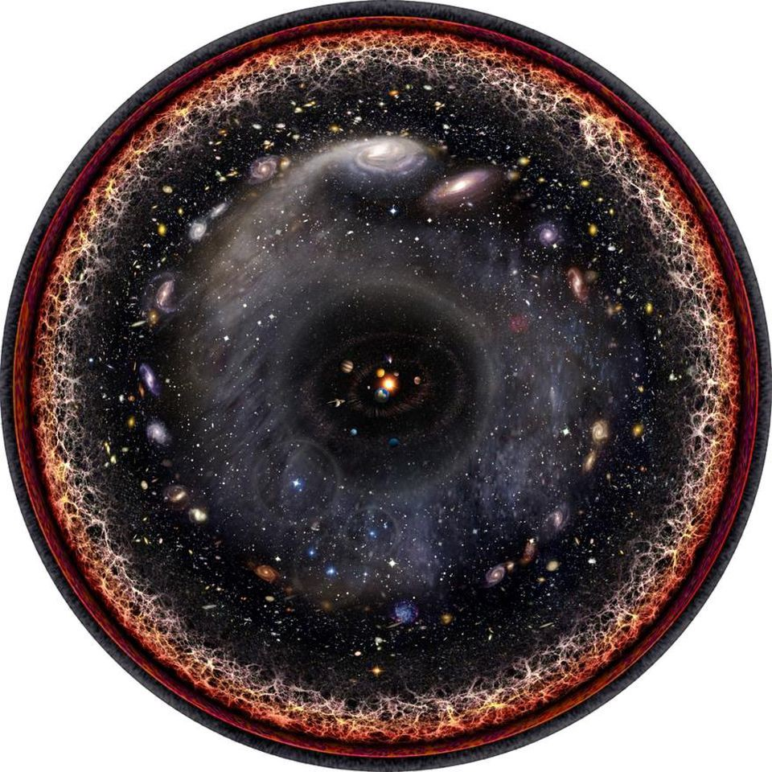

_I wrote this comment on a post by Dr. Stacy McGaugh at his Triton Station blog._

Regarding the prediction “that the background radiation will eventually resolve to be the light of ever further sources, shifted off the visible spectrum”

This is why the JWST is incredibly exciting to me. As I understand it, the JWST will be capable of observing farther away in time and distance than previous instruments. If it sees what I predict it will see, that will be the end of LCDM in its current form. As before, I think a lot of LCDM will be recoverable, but simply turned inside out and transformed to a hypothesis of galaxy local inflationary mini-bangs (GLIM?) in an ~steady-state cosmology.

Nobel winner Brian Schmidt mentioned in a 2012 lecture that the Hubble deep field images each cover about one 32 millionth of the sky and that each image shows around 5000 galaxies. 

That is about 160 billion galaxies near the surface of the observable sphere at a range of ~10B years ago. What is the proportion of galaxies that have jetting SMBH or AGN at any one time? What fraction of the galaxies mini-banging in the even more distant Planck CMB observations would be required to account for the Planck photon observations? And in particular the power spectrum — keeping in mind it is basically the banging process but distributed in locality and time (intermittent).

Could a professional astrophysicist please explain whether CMB observations are merely consistent with a Big Bang or actual evidence of a Big Bang? Could the CMB observations also be consistent with galaxy local inflationary mini-bangs? 

* * *

_A follower of Triton Station offered this helpful response._

“Could the CMB observations also be consistent with galaxy local inflationary mini-bangs?”

- If you mean, “Does red-shifted starlight average out to look like the CMB?” Then the answer is no. See here for an old (1997) understandable explanation:
    - [http://www.astro.ucla.edu/~wright/stars\_vs\_cmb.html](http://www.astro.ucla.edu/~wright/stars_vs_cmb.html)

- If you mean, “Do active galactic nuclei spectra look like the CMB?” Then the answer is no, there are broad categories of AGN but generally their spectra all look different and nothing like a black-body. See here for a few old examples:
    - [https://astronomy.swin.edu.au/cosmos/a/Active+Galactic+Nuclei](https://astronomy.swin.edu.au/cosmos/a/Active+Galactic+Nuclei)
    
    - [https://pages.astronomy.ua.edu/keel/agn/spectra.html](https://pages.astronomy.ua.edu/keel/agn/spectra.html)

- Note that adding millions of different random spectra together won’t average to give a perfect black-body.

- Also adding multiple different perfect black-body spectra together doesn’t give you a perfect black-body spectrum in total, it just gives you a smeared out curve.

- The CMB has been measured to be such a perfect fit to a black-body curve that it is a stringent test of predictions from cosmological models.

* * *

I have been examining the evidence provided and thinking about what else could be causing the CMB if the commenter is entirely right.

One idea that comes to mind is that all structures have Noether engines that are perfect black bodies. All structures meaning all generation I fermions as well as the bosons. This includes the structured particles that make the spacetime aether. All of these structures redshift, meaning their engines either continuously or occasionally yield some energy. The implementation of that process is not yet known. What could possibly be issuing the photons that we detect as CMB?

- Could it be low energy spacetime aether, typical of 'outer space,' redshifting? I don't know if those low energy Noether engines have enough energy remaining to generate a CMB photon.

- Do redshifting neutrinos issue CMB photons?

- Do redshifting photons issue CMB photons?

- Are there any portions of the redshift process where a CMB photon could possibly occur?

- What exactly is the process whereby a photon redshifts to the point that it puffs up and drops out of light speed? Are there any other subsidiary reactions during this process?

I don't yet have a full implementation model for the redshift process and whether it could emit the photons we are seeking. My gut feel is that redshift is a continuous small phase shift as photons pass through or by aether particles that themselves are slowly dissipatingenergy. Once that is known, then all the photons generated and passing through the observation volume must be considered.

There are other potential root causes that are the more typical collision based reactions. I have no feel for the chance that such processes could generate the CMB photons we seek.

- photon : photon collision

- photon : neutrino collision

- neutrino : neutrino collision

- exotic results of higher energy gen II and gen III decay products.

One of the challenges for NPQG is in determining whether the physicists conclusions are correct, incorrect, or if they provided new insights. It's time to take a closer look at the evidence provided above.

* * *

In the popular _Λ_CDM model, the CMB is tightly interwoven with the erroneous idea of a point in time inflationary Big Bang. In NPQG we know that cosmology is driven by a galaxy local mini-bang, inflation, expansion process. So what does that mean for the CMB? If the CMB is not the remnant radiation from the one time Big Bang some 13.8 billion years ago, then what is it? We'll explore this issue along with new questions such as the following.

- Where did the photons in the CMB originate?

- How old are the photons in the CMB?

- What causes the multi-peaked CMB power spectrum?

This video from PBS Space Time presents a _Λ_CDM perspective on the CMB.

https://youtu.be/C4CKtEQJGMY

NPQG is based on immutable point charges in Euclidean time and space. An emergent point charge assembly forms an aether that implements Riemannian spacetime. All other matter-energy particles emerge as well.

Where do CMB photons originate? How old are they? I imagine that they could have a variety of sources. We already know that photons experience redshift from crossing galaxy after galaxy that are expanding into one another. If the universe is large enough and old enough, presumably there would be enough travel time and travel distance for photons to continue to yield energy to expansion until they barely have any energy remaining.

Also, let's remember that we do not know if the rate of photon redshift (energy drain) per unit distance is constant. It could depend on photon energy. It could depend on expansion rate. It could depend on the energy level of the spacetime through which the photon passes. Also, we don't know what happens at extremely low photon energy. Do the photons decay and if so into what? Do the photons react with one another? Is there some low energy range where the photons no longer travel at the speed of light?

<figure>

<figcaption>

CMB Power Spectrum (Wikipedia)

</figcaption>

</figure>

Is the CMB power spectrum possibly something quite different than science currently models? When I look at the power spectrum picture, I wonder if it is the sum of the black body curves for the binaries of the Noether cores that comprise spacetime aether in each of their formation epochs.

See this [article from Ethan Siegel](https://medium.com/starts-with-a-bang/this-is-how-we-know-there-are-two-trillion-galaxies-in-the-universe-15fc0fea950b) asserting there are over **2 trillion galaxies in the observable universe**. Wow! Now considering the logical arguments in this post is there any doubt that the recycling process through the AGN SMBH is the physical implementation of the Big Bang, inflation, and expansion? Clearly this galaxy local process in aggregate is what scientists have been seeking.

<figure>

<figcaption>

 WIKIPEDIA - PABLO CARLOS BUDASSI

</figcaption>

</figure>

**_J Mark Morris : San Diego : California_**

p.s. I have had some speculative thoughts about alternative mechanisms that might cause the CMB. Here is one idea. It's may well be "not even wrong".

Standard matter assemblies possess shielded energy hundreds to thousands of times their apparent energy. That includes photons and spacetime aether assemblies, both of which appear massless, but are just very low apparent mass. The two inner binaries in any standard matter assemblies Noether cores **MUST** have been formed in very high energy environments, perhaps not unlike a "bang", although I think it is parallel independent mini-bangs rather than a singular Big Bang.

**Brainstorm speculation :** **Is the CMB an artificat of the decay of ultimately redshifted photons?** Each photon that survives will ultimately redshift and lose their planar shape, puff up, and drop out of light speed. There may even be a point where the outer binary of a photon decays and the inner two binaries set off a chain reaction of energy transfers. Perhaps that is what we are measuring in the cosmic microwave background power spectrum. Could the CMB be a measurement of shielding decomposition of a photon? The science of the power spectrum of the CMB may be very important to the science of energy shielding. Note this would still be compatible with the 1 in 100,000 variation in the CMB which is the variation in intensity from the radiating regions. Still, those photons degrade somewhere, and this may be what we are measuring. Can we measure radio wave photons? What is the lowest frequency photon that is detectable? Do we need to go to the dark side of the moon to answer these question?

If we can explain the CMB and its power spectrum with routine processes in a never-ending universe then we can get away from the idea of the Big Bang and/or the the Ice-Nine and Plasma-Ten equivalents, which are/were quite disconcerting to me. I mean it's one thing to fear that someone could take point charge technology and destroy the Earth, but it is quite another to wonder if a Plasma-Ten destroy the Universe type event could be likewise initated. I suspect that science already knows the answer to these questions given that they create gen II and gen III fermions and other high energy exotics as a matter of routine course and that is nothing at all compared to the energy intensity of high energy events in the laboratory of the universe. If it were possible to create a Plasma-Ten event, one might expect that the vast variety of reactions in the universe would have done so more frequently than what in our cycle appears to be 13.8B years.
