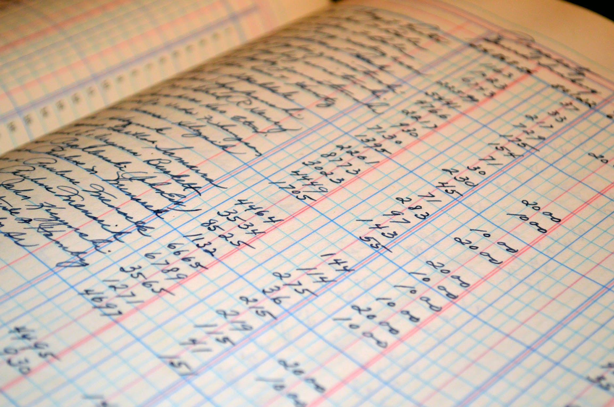

This post is about developing an intuition about how nature behaves given the fundamental ingredients of the universe as informed by NPQG. The chart below shows the elements of the NPQG universe. This is it. There are no other physical elements. This set of ingredients follows the physical laws of classical mechanics and electromagnetism and from the interactions that occur, everything else in nature emerges.

Let’s start by reviewing the concept of intuition. Intuition is grounded in a feeling and a past or history.

> _Intuition is the ability to acquire knowledge without recourse to conscious reasoning. Different fields use the word "intuition" in very different ways, including but not limited to: direct access to unconscious knowledge; unconscious cognition; inner sensing; inner insight to unconscious pattern-recognition; and the ability to understand something instinctively, without any need for conscious reasoning._
> 
> _The word intuition comes from the Latin verb intueri translated as "consider" or from the late middle English word intuit, "to contemplate"._
> 
> Wikipedia

GR/QM era physics is attempting to discover nature from the top down in knowledge and the outside-in towards ever smaller and more energetic particles. Without a physical implementation I struggle to imagine how GR/QM era physicists can develop intuition about nature. You can see this in the patchwork quilt of theories, maths, interpretations and leading narratives. There are so many gaps and redundancies it is clear that progress is blocked or nearly so. I suggest that the blockage is mainly mental.

NPQG flips the problem around. We start by looking for the simplest possible physical explanation for nature. We already know the huge role of emergence in our universe, so let's take the elevator down to 10\-36 and look around. **_What would nature do?_** You get a clue of a physical implementation and start imagining an architecture. Then the thought experiments can begin, given all the knowledge you have gained from physics outreach social media. And repeat until the architecture starts taking shape.

Once you truly understand the fundamental basis of nature and then resolve yourself to this concept, the grand cycles in the universe quickly become apparent. After all, it is about cycles and **cycles within** **cycles**. NPQG may at first seem counterintuitive, but upon more reflection the grand pattern emerges and is sensible and becomes **_the new intuitive_**.

<figure>

<figcaption>

Photos from nps.gov

</figcaption>

</figure>

One of the first subjects that comes to mind is that hot air rises. We define **rises** to mean away from Earth. Yet, from another perspective, hot air rises above cooler air. What is really happening with hot air and cool air? A little bit of physics tells us that hot air is less dense than cool air and therefore experiences a buoyancy that causes it to rise above the cool air.

Yet on the other hand, gravity causes standard matter to experience a force towards massive objects. Massive objects have energetic, hot, cores, for example, the earth has an iron core at about 10,800 degrees Fahrenheit. NPQG teaches that matter-energy in spacetime æther experiences a force towards the steepest energy gradient.

These two situations might seem contradictory, but they aren't really. Each is driven by entirely different physics.

> **Emmy Noether's theorem states that every differentiable symmetry of the action of a physical system has a corresponding conservation law.**
> 
> Wikipedia

Let's reflect on Emmy Noether's teachings on conservation. Conservation may be thought of as a double entry bookkeeping system. If one side goes up, the other must go down. This is the essence of differentiability. No asymmetries are allowed in conservation. Fortunately nature provides spacetime æther as a quantum bookkeeper for reactions with standard matter-energy. As a result of Noether's theorem, the net exchange of continuous energy or conserved quanta between spacetime æther and standard matter must move in a debit-credit or credit-debit arrangement. Now that all said, spacetime æther and standard matter are each composite structures, and many transactions are in quantum units. However, not all transactions are quantum — gravity is continuous.

<figure>

<figcaption>

Photo by Pixabay on [Pexels.com](https://www.pexels.com/photo/white-graphing-paper-164686/)

</figcaption>

</figure>

**_J Mark Morris : San Diego : California_**
